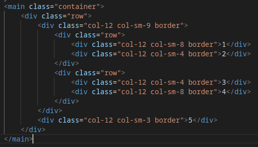

**Empezando a practicar boostrap 5.**

Hace mil que habia visto boostrap muy por arriba sin pikar nada de el, bueno, eso ha tenido que cambiar. Si bien prefiero el CSS vanilla (osea sin ningun aditivo) la clase de react lo pide porque lo tenemos que usar y no me voy a quedar abajo del tren.   

Aunque es en cierta forma un misterio como funciona Bootstrap para mi comprendo de que se trata. Simplificando: boostrap es la manera de llevar css a nuestras paginas sin editar nosotros el css, tan solo cargando clases en las diferentes etiquetas. Este atributo de class que nosotros carguemos debera tener unas caracteriticas en su escritura que buscaran en las lineas de codigo de boostrap los atributos que afectarà su comportamiento.  
Eso lo hace bastante versatil, rapido si se conoce de que se trata y se sabe que hay que colocar en cada clase, pero... escapa un poco el control que uno tiene sobre el aspecto visual del sitio. Para hacer paginas rapido sin grandes pretenciones sirve, para algo mas personalizado no.  

Tras estar renegando un rato con la *gridya* le encontre la vuelta y le empeze a tomar el gustito.  
Es muy importante penzar siempre *mobile-first*. Si es hacer cuatro veces hacer el trabajo pero bueno... uno quiere ser FULLSTACK y tiene que hacerlo.    

Pero y porque cuatro veces?... pues porque tenemos 4 tamaños de pantalla diferentes, o mas o menos, entre celulares, tablets, compus y teles y que se yo... hoy hasta una heladera tiene pantalla.    

GRID: lo primero que tenemos que establecer es la classe container en nuestra etiqueta contenedora, que puede ser un div o main o cualquiera que haga de marco. Esta desde ya que nos deja un espaciado entre nuestros elemento y el borde de la pantalla. Luego debemos colocar la fila *row* que podria o no llevar algun otro atributo. Despues en otro div hijo colocamos las columnas que siempre seran 12 en total. Y esta esipulado asi aunque se puede cambiar. Es decir que si solo colocamos in div con *class="col-6"* esta abarcara tan solo la mitad de la etiqueta padre.   
Se puede crear mas columnas dentro de las columnas para que de esta forma se puedan dar lugar a diferetes formas.  
  
     
  
BG-: colcando el atributo *bg-algo* podemos dar color del fondo a nuestros elementos.

Flex: flex es una forma de colocar elementos en la pantalla de forma horizontal, por eso se dice que tiene una sola dimension (horizontal) y no dos como grid (horizontal y vertical). Flex sirve entre otras cosas para alinear nuestros contenidos horizontal y verticalmente asi como tambien distribuirlos dentro de nuestro espacio contenedor.  

  
IMPORTANTE  
- Con node ya instalado correr el comando npm para instalar boostrap, esto descargara bootstrap en nuestros sistema.   
- Tener instalado el live sass compiler que se encarga de "observar los cambios que hacemos en nuestro archivos Sass (que nos permite trabajar con variables) y luego los transforma en un css que pueda leer el navegador.  
- Despues de que terminermos de trabajar con el archivo css debemos descargar o ya tener descargado el programa purgecss a traves de npm
- El PurgeCss se encargara de generar un achivo nuevo reducido de nuestro css custom eliminando todas las lineas de mas que descargamos al instalar bootstrap.  
- A para no olvidar: cada vez que retoquemos nuestro css en el custom no se podra ver ya que esta cargado en el archivo reducido.
- Otra cosa importante es ver bien que archivos van a desplegarse en el servidor para no estar subiendo archivos basura o demasiado grandes para nada.  
    
    [video de bluuweb](https://youtu.be/1kNwZbRiVcQ)